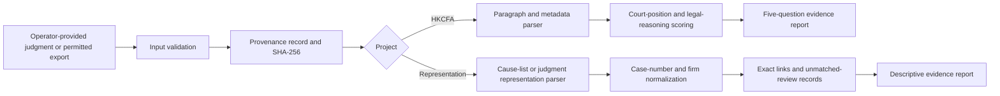

# Architecture and Operating Models

## Decision Context

Both projects combine deterministic parsing with legal judgment that must remain reviewable. Cause-list publication windows, copyright conditions, personal-data restrictions, and the reputational consequences of inaccurate inferences make an unattended public scraper inappropriate for the initial public release.

## Viable Operating Models

| Approach | Tradeoffs | Cost | Setup complexity |
|---|---|---:|---:|
| **Local evidence toolkit**: operators download or provide material they are entitled to process, then run deterministic import, matching, and reporting commands | Strongest provenance and privacy control; no always-on monitoring; operator controls each corpus refresh | No hosting cost | Low |
| **Managed web dashboard with scheduled ingestion**: a hosted database, review queue, and periodic jobs process authorised sources | Easier ongoing monitoring and collaboration; requires explicit source permission, retention controls, authentication, and operating oversight | Hosting and database usage | Medium to high |

The public repository implements the **local evidence toolkit** as the safe, reproducible baseline. Parsing, normalization, comparison, provenance, and report generation are separated from command-line argument handling so a future authenticated dashboard can reuse the same deterministic rules after the operator resolves source permissions and deployment requirements.

## Component Architecture

| Component | Responsibility |
|---|---|
| `legalless.provenance` | Source metadata, retrieval timestamps, SHA-256 digests, parser version, and warnings |
| `legalless.cfa` | HKCFA verification, front-matter and paragraph parsing, five-question extraction, ratio-candidate scoring, and report generation |
| `legalless.representation` | Cause-list/judgment CSV validation, case-number and firm normalization, anonymization handling, exact evidence links, suppression, and descriptive reports |
| `legalless.cli` | Stable local commands, exit statuses, and JSON/Markdown/CSV output handling |
| `tests` | Deterministic regression and command-contract tests using synthetic structural fixtures |

## Processing Flow

## Non-negotiable Boundaries

The software does not bypass access controls, archive pages contrary to publication conditions, de-anonymize “A Firm” labels, rank individual practitioners, infer blame from adjournments or suspensions, or treat absence from the indexed corpus as proof that no final judgment exists. Raw source material remains excluded from Git by default.

## Future Deployment Boundary

A hosted edition should be considered only after confirming the legal basis for each source, defining a retention schedule, implementing role-based access and correction procedures, and documenting a review process for any firm-level publication. A future persistent data layer and review queue are not part of this release. If later authorised, scheduled deterministic ingestion should run as application background jobs; legal extraction may remain deterministic or use a separately disclosed model-assisted step with mandatory evidence review.
